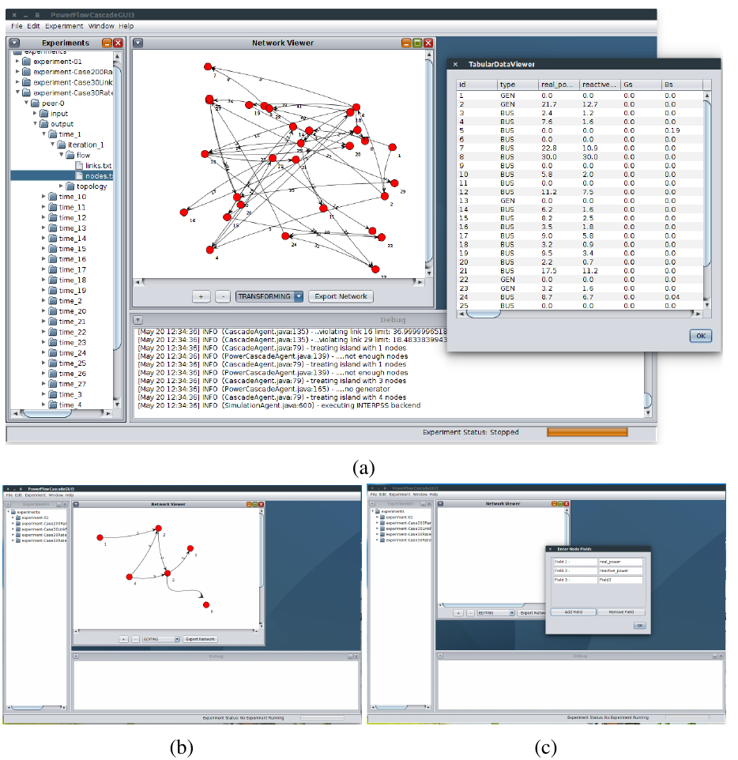
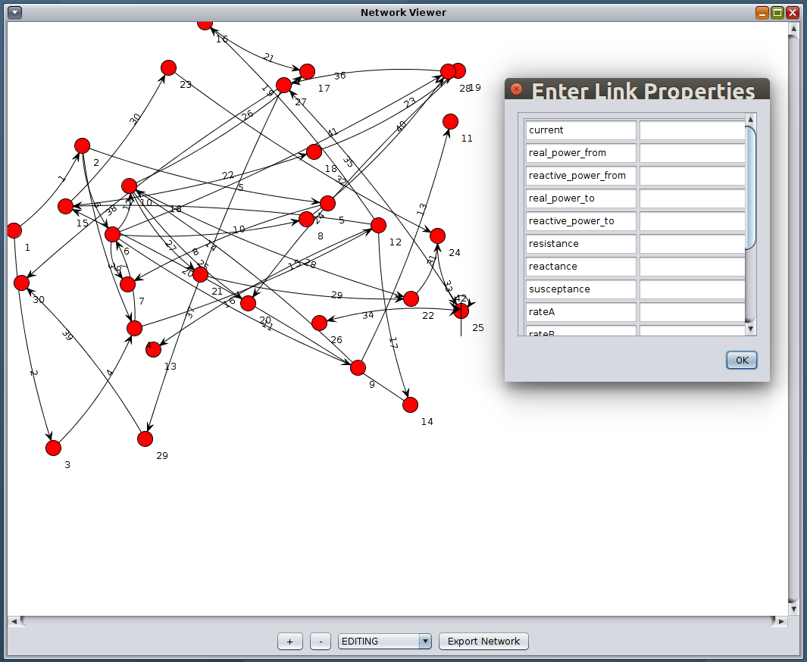

# GUI
Visulizations and GUI related code.

### SFINAGUI
* SFINAGUI is a Java Swing and Jung Library based GUI that provides interactive environment to use SFINA Experiments.
* Users can interactively create SFINA Networks, edit experiment configurations, view network files, run experiments etc.

### SfinaNetworkGenerator
* Extends examples in Jung Library to generate SFINA Networks with flow properties
